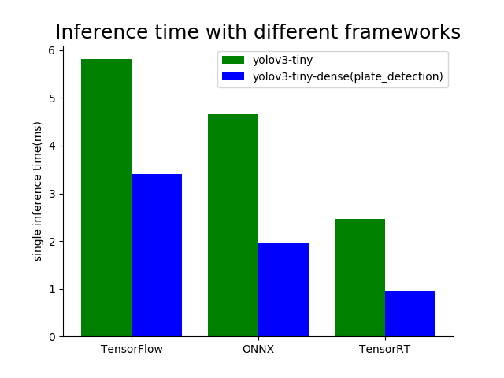

# ONNX2TensorRT

采用Darknet框架训练目标检测网络到最终部署整体上的的工作栈大致如下:

Darknet ---> ONNX ---> TensorRT ---> TensorRT Inference Serving(TRTIS)

Darknet ---> ONNX这个步骤可以参考我的另一个工程[darknet2onnx](https://github.com/MAhaitao999/darknet2onnx)

本工程主要讲的是ONNX ---> TensorRT这个步骤.

我主要尝试转了2个模型, 分别对应两个文件夹:

- yolov3-tiny

- plate_detection(yolov3-tiny-dense)

同时我还对比了上述两个网络在ONNX, TensorFlow以及TensorRT三个框架上的推理时间(测试环境为GeForce GTX 1660), 推理时间如下图所示:

从图中可以看出, TensorRT的推理速度至少有了一倍的提升.
